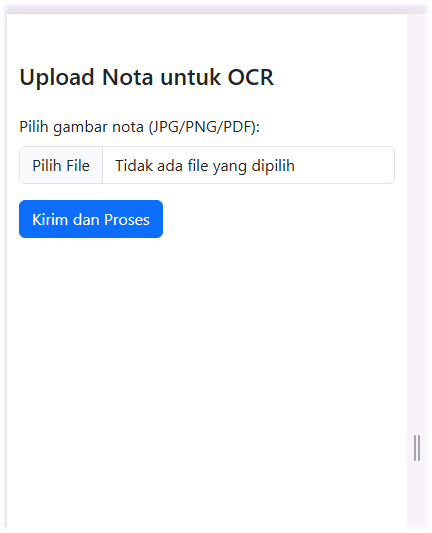

# OCR Nota Upload App

Aplikasi web sederhana untuk mengunggah gambar nota (JPG, PNG, atau PDF) dan membaca teksnya menggunakan API dari [OCR.Space](https://ocr.space).

## 🧩 Fitur

- Upload gambar nota (image atau PDF)
- Preview gambar sebelum dikirim
- Pemrosesan teks menggunakan OCR.Space API
- Simpan hasil teks OCR ke database MySQL
- Antarmuka dengan Bootstrap 5

## 🖼️ Screenshot




## 🚀 Cara Pakai

1. **Clone repo ini** atau upload ke server hosting.
2. Pastikan PHP dan MySQL tersedia.
3. Edit file `proses.php`, sesuaikan:
   - `apikey` dari OCR.Space
   - Konfigurasi database (`$db_host`, `$db_user`, dll)

4. Buat tabel MySQL seperti ini:

```sql
CREATE TABLE `ocr_results` (
  `id` INT NOT NULL AUTO_INCREMENT PRIMARY KEY,
  `filename` VARCHAR(255),
  `ocr_text` TEXT,
  `created_at` DATETIME
);

🔐 API Key OCR.Space
Dapatkan API key gratis dari: https://ocr.space/OCRAPI

📂 Struktur File
graphql
Salin
Edit
├── index.html      # Halaman form upload dan preview
├── proses.php      # Proses OCR dan simpan ke database
└── README.md       # Dokumentasi
